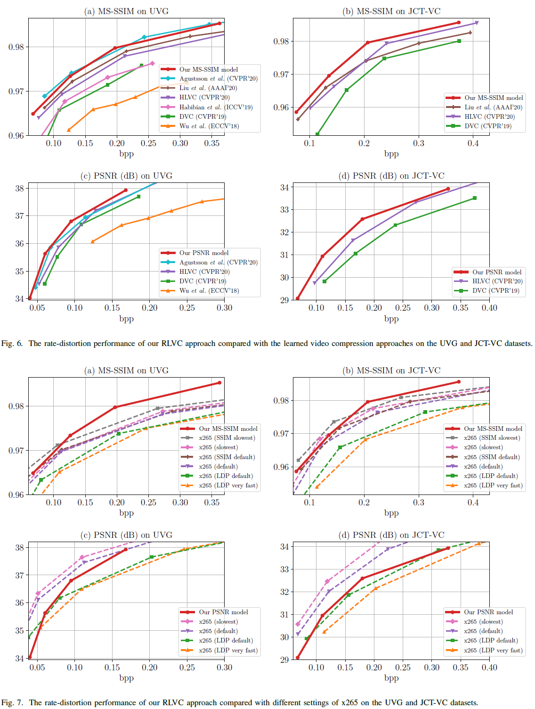

# Learning for Video Compression with Recurrent Auto-Encoder and Recurrent Probability Model

The project page for the paper:

> Ren Yang, Fabian Mentzer, Luc Van Gool and Radu Timofte, "Learning for Video Compression with Recurrent Auto-Encoder and Recurrent Probability Model", IEEE Journal of Selected Topics in Signal Processing (J-STSP), 2021. [[Paper]](https://arxiv.org/pdf/2006.13560.pdf)

If our paper and codes are useful for your research, please cite:
```
@article{yang2021learning,
  title={Learning for Video Compression with Recurrent Auto-Encoder and Recurrent Probability Model},
  author={Yang, Ren and Mentzer, Fabian and Van Gool, Luc and Timofte, Radu},
  journal={IEEE Journal of Selected Topics in Signal Processing},
  year={2021}
}
```

If you have questions or find bugs, please contact:

Ren Yang @ ETH Zurich, Switzerland   

Email: ren.yang@vision.ee.ethz.ch

## Codes

### Preperation

We feed RGB images into the our encoder. To compress a YUV video, please first convert to PNG images with the following command.

```
ffmpeg -pix_fmt yuv420p -s WidthxHeight -i Name.yuv -vframes Frame path_to_PNG/f%03d.png
```

Note that, our RLVC codes currently only support the frames with the height and width as the multiples of 16. Therefore, when using these codes, if the height and width of frames are not the multiples of 16, please first crop frames, e.g.,

```
ffmpeg -pix_fmt yuv420p -s 1920x1080 -i Name.yuv -vframes Frame -filter:v "crop=1920:1072:0:0" path_to_PNG/f%03d.png
```

We uploaded a prepared sequence *BasketballPass* here as a test demo, which contains the PNG files of the first 100 frames. 

### Dependency

- Tensorflow 1.12
  
  (*Since we train the models on tensorflow-compression 1.0, which is only compatibable with tf 1.12, the pre-trained models are not compatible with higher versions.*)

- Tensorflow-compression 1.0 ([Download link](https://github.com/tensorflow/compression/releases/tag/v1.0))

  (*After downloading, put the folder "tensorflow_compression" to the same directory as the codes.*)
  
- SciPy 1.2.0

  (*Since we use misc.imread, do not use higher versions in which misc.imread is removed.*)

- Pre-trained models ([Download link](https://data.vision.ee.ethz.ch/reyang/model.zip))

  (*Download the folder "model" to the same directory as the codes.*)

- BPG ([Download link](https://bellard.org/bpg/))  -- needed only for the PSNR model

  (*In our PSNR model, we use BPG to compress I-frames instead of training learned image compression models.*)

- Context-adaptive image compression model, Lee et al., ICLR 2019 ([Paper](https://arxiv.org/abs/1809.10452), [Model](https://github.com/JooyoungLeeETRI/CA_Entropy_Model)) -- needed only for the MS-SSIM model

  (*In our MS-SSIM model, we use Lee et al., ICLR 2019 to compress I-frames.*)

### Encoder

RLVC.py is the encoder of the RLVC approach. The RLVC supports two GOP structures, i.e., uni-IPPP and bi-IPPP (see Sec. V-A in the [paper](https://arxiv.org/abs/1809.10452)). In the augments, "--f_P" denotes the number of P frames to be encoded in the forward direction, and "--b_P" denotes the number of P frames to be encoded in the backward direction. For example, "--f_P 6 --b_P 6" indicates GOP13 (bi-IPPP), which is the default setting of RLVC; "--f_P 9 --b_P 0" indicates GOP10 (uni-IPPP), see Fig. 14 and Fig. 15 in our [paper](https://arxiv.org/abs/1809.10452).

In this code, we use a [Python implementation of arithmetic coding](https://github.com/nayuki/Reference-arithmetic-coding/tree/master/python), which is not optimized for speed. We provide an option "--entropy_coding" to enable (=1, slow) or disable (=0, fast) the arithmetic coding. If "--entropy_coding 0", the bit-rate will be estimated via PMFs.

The augments in the RLVC encoder (RLVC.py) include:

```
--path, the path to PNG files;

--frame, the total frame number to compress;

--f_P, number of forward P frames;

--b_P, number of backward P frames;

--mode, compress with the PSNR or MS-SSIM optimized model;

--metric, evaluate quality in terms of PSNR or MS-SSIM;

--python_path, the path to python (only used for the MS-SSIM models to run Lee et al., ICLR 2019 on I-frames);

--CA_model_path, the path to CA_EntropyModel_Test of Lee et al., ICLR 2019 (only used for the MS-SSIM models);

--l, lambda value. The pre-trained PSNR models are trained by 4 lambda values, i.e., 256, 512, 1024 and 2048, with increasing bit-rate/PSNR. The MS-SSIM models are trained with lambda values of 8, 16, 32 and 64, with increasing bit-rate/MS-SSIM;

--entropy_coding, enable (=1) or disable (=0) the artimetic coding.
```
For example:
```
python RLVC.py --path BasketballPass --f_P 6 --b_P 6 --mode PSNR  --metric PSNR --l 1024
```
```
python RLVC.py --path BasketballPass --f_P 6 --b_P 6 --mode MS-SSIM  --metric MS-SSIM --python python --CA_model_path ./CA_EntropyModel_Test --l 32
```
The RLVC encoder generates the compressed frames, the encoded bit-stream and the latent representations in three folders.
```
path = args.path + '/'
path_com = args.path + '_' + args.mode + '_' + str(args.l) + '/frames/'
path_bin = args.path + '_' + args.mode + '_' + str(args.l) + '/bitstreams/'
path_lat = args.path + '_' + args.mode + '_' + str(args.l) + '/latents/'
```
### Decoder

RLVC_decoder.py is the encoder of the RLVC approach. Note that the decoder is workable only if "--entropy_coding 1" is set in the encoder.

```
--path, the path to PNG files;

--frame, the total frame number to compress;

--f_P, number of forward P frames;

--b_P, number of backward P frames;

--mode, compress with the PSNR or MS-SSIM optimized model;

--python_path, the path to python (only used for the MS-SSIM models to run Lee et al., ICLR 2019 on I-frames);

--CA_model_path, the path to CA_EntropyModel_Test of Lee et al., ICLR 2019 (only used for the MS-SSIM models);

--l, lambda value. The pre-trained PSNR models are trained by 4 lambda values, i.e., 256, 512, 1024 and 2048, with increasing bit-rate/PSNR. The MS-SSIM models are trained with lambda values of 8, 16, 32 and 64, with increasing bit-rate/MS-SSIM;
```
For example:
```
python RLVC_decoder.py --path BasketballPass --f_P 6 --b_P 6 --mode PSNR --l 1024
```
```
python RLVC_decoder.py --path BasketballPass --f_P 6 --b_P 6 --mode MS-SSIM --python python --CA_model_path ./CA_EntropyModel_Test --l 32
```
The RLVC encoder generates the decoded frames and the decoded latent representations.
```
path = args.path + '/'
path_com = args.path + '_' + args.mode + '_' + str(args.l) + '/frames_dec/'
path_lat = args.path + '_' + args.mode + '_' + str(args.l) + '/latents_dec/'
```
The decoded frames and the compressed frames are expected to be the same (with little difference if using GPU due to non-determinism). The decoded latents and the compressed latents must be exactly the same, otherwise the decoding will be incorrect. Therefore, we use CPU mode (device_count={'GPU': 0}) in RPM to ensure the determinism. Applying the [deterministic TensorFlow-GPU](https://pypi.org/project/tensorflow-determinism/) may be a more elegant way.

## Performance

We follow previous works [DVC](https://arxiv.org/abs/1812.00101), [HLVC](https://arxiv.org/abs/2003.01966) and [Liu *et al.*, AAAI](https://ojs.aaai.org//index.php/AAAI/article/view/6825) to evaluate the performance on the first 100 frames of the JCT-VC dataset (Classes B, C and D) and all frames of the [UVG](http://ultravideo.cs.tut.fi/#testsequences) dataset (7 videos: Beauty, Bosphorus, HoneyBee, Jockey, ReadySetGo, ShakeNDry and YachtRide). The rate-distortion curves are illustrated below.


